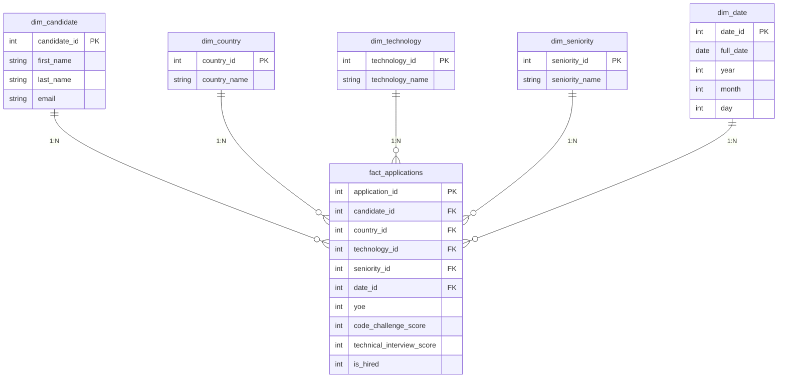

# Workshop-1
# Design a Dimensional Data Model (Star Schema).

A continuación se presenta el modelo dimensional del proyecto:

---

## Architecture & Design Justification

### ¿Por qué un modelo en estrella?
Elegí un esquema en estrella porque simplifica enormemente los JOINs entre la tabla de hechos (`fact_applications`) y las dimensiones. En lugar de anidar múltiples niveles de relaciones, cada dimensión se conecta directamente a la tabla central, lo que se traduce en consultas más rápidas y más fáciles de leer — algo clave tanto si el análisis se hace desde SQL como desde Pandas o una herramienta de BI.

### Definiendo el grano
Antes de diseñar las tablas, definí qué representa cada fila de la fact table: **una postulación individual de un candidato en una fecha específica**. Esta decisión es la base de todo el modelo, porque permite calcular con precisión promedios de puntaje, tasas de contratación y métricas de experiencia sin ambigüedad sobre qué se está midiendo.

### Cómo se organizaron las dimensiones
* **`dim_candidate`**: Separa la información personal (nombre, email) del resto del modelo. Esto no solo evita duplicar datos demográficos, sino que también aísla la información de identificación personal (PII).
* **`dim_country` y `dim_technology`**: Normalizan los nombres de países y tecnologías para evitar la redundancia de texto en la tabla de hechos.
* **`dim_seniority`**: Categoriza los niveles de experiencia y maneja los valores nulos o faltantes etiquetándolos como `'Unknown'`.
* **`dim_date`**: Descompone la fecha de aplicación en `year`, `month` y `day` para optimizar las consultas temporales y agregaciones por año.

  ---

## ETL Process (Extract, Transform, Load)

The ETL pipeline processes the raw candidate dataset, applies data quality and business logic transformations, and loads the structured data into a local SQLite Data Warehouse.

### a. Extract
* **Source**: `candidates.csv` containing raw application records.
* **Implementation**: The dataset is ingested directly into memory using Pandas (`pd.read_csv()`) for efficient batch processing.

### b. Transform
The transformation stage cleans invalid records, computes business logic fields, and normalizes data into a Star Schema structure:

1. **Data Cleaning**:
   * **Missing Values**: Missing values in `Seniority` are imputed as `'Unknown'`. Missing numerical values in `Yoe` (Years of Experience) and `Technical Interview` scores are replaced with `0`. Null `Email` values are filled with `'N/A'`.
   * **Date Formatting**: `Application Date` is converted to standard `datetime` objects to allow temporal extraction.

2. **Apply the "HIRED" Rule**:
   * A candidate is flagged as hired (`is_hired = 1`) **if and only if**:
     $$\text{Code Challenge Score} \ge 7 \quad \text{AND} \quad \text{Technical Interview} \ge 7$$
   * Candidates failing either threshold are flagged as `is_hired = 0`.

3. **Dimensional Modeling & Mapping**:
   * Unique entity values are extracted to generate normalized dimension tables (`dim_candidate`, `dim_country`, `dim_technology`, `dim_seniority`, `dim_date`).
   * Auto-incrementing surrogate keys (`_id`) are generated for each dimension and mapped back to the central fact table (`fact_applications`).

### c. Load
* **Target**: `data_warehouse.db` (SQLite relational database).
* **Execution**: Transformed DataFrames are persisted into the relational Data Warehouse using `to_sql()` with `if_exists='replace'` to ensure pipeline idempotency.
* **Data Integrity**: Row count validations are executed post-load to confirm zero data loss across all tables (e.g., 50,000 application records successfully verified in `fact_applications`).
