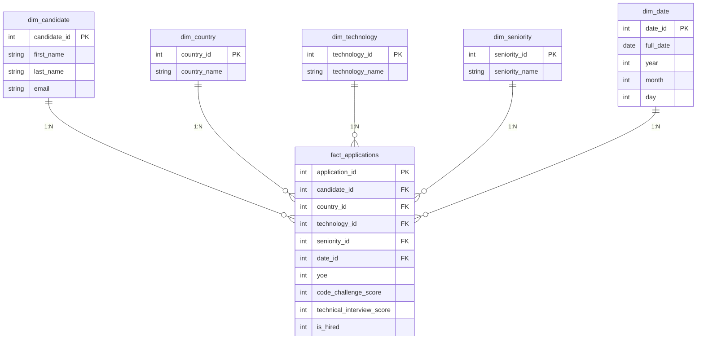

# Workshop-1
# Design a Dimensional Data Model (Star Schema).

A continuación se presenta el modelo dimensional del proyecto:

---

## Architecture & Design Justification

### ¿Por qué un modelo en estrella?
Elegí un esquema en estrella porque simplifica enormemente los JOINs entre la tabla de hechos (`fact_applications`) y las dimensiones. En lugar de anidar múltiples niveles de relaciones, cada dimensión se conecta directamente a la tabla central, lo que se traduce en consultas más rápidas y más fáciles de leer — algo clave tanto si el análisis se hace desde SQL como desde Pandas o una herramienta de BI.

### Definiendo el grano
Antes de diseñar las tablas, definí qué representa cada fila de la fact table: **una postulación individual de un candidato en una fecha específica**. Esta decisión es la base de todo el modelo, porque permite calcular con precisión promedios de puntaje, tasas de contratación y métricas de experiencia sin ambigüedad sobre qué se está midiendo.

### Cómo se organizaron las dimensiones
* **`dim_candidate`**: Separa la información personal (nombre, email) del resto del modelo. Esto no solo evita duplicar datos demográficos, sino que también aísla la información de identificación personal (PII).
* **`dim_country` y `dim_technology`**: Normalizan los nombres de países y tecnologías para evitar la redundancia de texto en la tabla de hechos.
* **`dim_seniority`**: Categoriza los niveles de experiencia y maneja los valores nulos o faltantes etiquetándolos como `'Unknown'`.
* **`dim_date`**: Descompone la fecha de aplicación en `year`, `month` y `day` para optimizar las consultas temporales y agregaciones por año.
