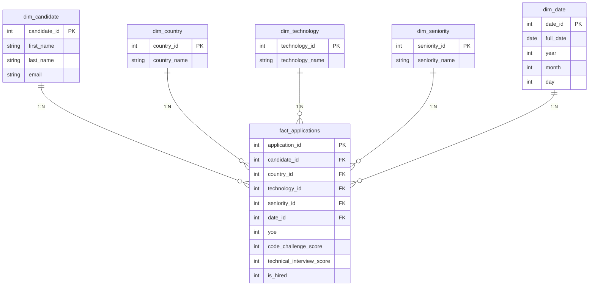

# Workshop-1
# Design a Dimensional Data Model (Star Schema).

A continuación se presenta el modelo dimensional del proyecto:

```mermaid
erDiagram
    dim_candidate ||--o{ fact_applications : "1:N"
    dim_country ||--o{ fact_applications : "1:N"
    dim_technology ||--o{ fact_applications : "1:N"
    dim_seniority ||--o{ fact_applications : "1:N"
    dim_date ||--o{ fact_applications : "1:N"

    fact_applications {
        int application_id PK
        int candidate_id FK
        int country_id FK
        int technology_id FK
        int seniority_id FK
        int date_id FK
        int yoe
        int code_challenge_score
        int technical_interview_score
        int is_hired
    }

    dim_candidate {
        int candidate_id PK
        string first_name
        string last_name
        string email
    }

    dim_country {
        int country_id PK
        string country_name
    }

    dim_technology {
        int technology_id PK
        string technology_name
    }

    dim_seniority {
        int seniority_id PK
        string seniority_name
    }

    dim_date {
        int date_id PK
        date full_date
        int year
        int month
        int day
    }
```
